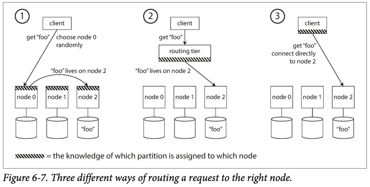

Designing Data Intensive Applications by Martin Kleppmann
In this book, we focus on three concerns that are important in most software systems:

# Part I: Foundation of Data Systems

## Chapter 1: Reliable, Scalable, and Maintainable Applications

**Reliability**
The system should continue to work correctly (performing the correct function at the desired level of performance) even
in the face of adversity (hardware or software faults, and even human error).

**Scalability**
As the system grows (in data volume, traffic volume, or complexity), there should be reasonable ways of dealing with
that growth.

**Maintainability**
Over time, many different people will work on the system (engineering and operations, both maintaining current
behavior and adapting the system to new use cases), and they should all be able to work on it productively.

Operations teams are vital to keeping a software system running smoothly. A good operations team typically is
responsible for the following, and more:
• Monitoring the health of the system and quickly restoring service if it goes into a bad state
• Tracking down the cause of problems, such as system failures or degraded performance
• Keeping software and platforms up to date, including security patches
• Keeping tabs on how different systems affect each other, so that a problematic change can be avoided before it causes
damage
• Anticipating future problems and solving them before they occur (e.g., capacity planning)
• Establishing good practices and tools for deployment, configuration management, and more
• Performing complex maintenance tasks, such as moving an application from one platform to another
• Maintaining the security of the system as configuration changes are made
• Defining processes that make operations predictable and help keep the production environment stable
• Preserving the organization’s knowledge about the system, even as individual people come and go

## Chapter 2: Data Models and Query Languages

NoSQL databases have been adopted quickly and easily because:

* It provided a better scaling mechanism, including very high write throughput than relational databases
* It was free and open source
* It supported few specific query operations better than relational databases
* It provided more dynamic and expressive data model than relational databases

Relational databases deal with the one-to-many relationship in one of three ways:

* The common normalized way is to put the many values in a separate table, with foreign key reference to the one
* Later versions of SQL allowed multi-valued data be stored in a single row, with support for querying inside them
* The least favorable option is to store them as encoded JSON or XML, and let the application do the internal query

Document-oriented databases on the other hand supports one-to-many relationship natively, and provides better locality
for the data object, thanks to the self-contained nature of JSON.

Query Languages

* SQL is attractive to people due to its declarative nature, it specifies the pattern of the resulted data instead of
  the way of querying it. Also, declarative code is easier to parallelize across multiple machines.
* MapReduce is fairly low-level programming model for distributed execution, but it doesn't have a monopoly on
  distributed query execution.
* Graph data model is usually the most suitable model for data with a lot of many-to-many relationships. There are many
  well-known algorithms which can operate on graphs, and some good declarative query languages such as Cypher for
  efficient querying.
* Graph data model is different from network model in the way it gives much greater flexibility for applications to
  adapt.

One thing that document and graph databases have in common is that they typically don’t enforce a schema for the data
they store, which can make it easier to adapt applications to changing requirements. However, your application most
likely still assumes that data has a certain structure; it’s just a question of whether the schema is explicit (
enforced on write) or implicit (handled on read).

## Chapter 3: Storage and Retrieval

Comma-separated values (**CSV**) is a text file format that uses commas to separate values, and newlines to separate
records.

A **Bloom filter** is a memory-efficient data structure for approximating the contents of a set. It can tell you if a
key does not appear in the database, and thus saves many unnecessary disk reads for nonexistent keys.
Answers strict NO or probably yes.

Businesses usually have two types databases, online transaction processing (OLTP) for every-day transactions, and online
analytic processing for analytics purposes (Also known as Data Warehouse).

## Chapter 4: Encoding and Evolution

Binary schema–driven formats like Thrift, Protocol Buffers, and Avro allow compact, efficient encoding with clearly
defined forward and backward compatibility semantics. The schemas can be useful for documentation and code generation in
statically typed languages. However, they have the downside that data needs to be decoded before it is
human-readable.

We can conclude that with a bit of care, backward/forward compatibility and rolling upgrades are quite achievable. May
your application’s evolution be rapid and your deployments be frequent.

# Part II: Distributed Data

## Chapter 5: Replication

In practice, if you enable synchronous replication on a database, it usually means that one of the followers is
synchronous, and the others are asynchronous. If the synchronous follower becomes unavailable or slow, one of the
asynchronous followers is made synchronous. This guarantees that you have an up-to-date copy of the data on at least two
nodes: the leader and one synchronous follower. This configuration is sometimes also called semi-synchronous.

Handling a failure of the leader is trickier: one of the followers needs to be promoted to be the new leader, clients
need to be reconfigured to send their writes to the new leader, and the other followers need to start consuming data
changes from the new leader. This process is called **failover**.

In read-scaling architecture long replication lag causes:

1) Inability to read your own writes: in this situation, we need read-after-write consistency, also known as
   read-your-writes consistency.
2) Monotonic Reads: A user first reads from a fresh replica, then from a stale replica. Time appears to go backward. To
   prevent this anomaly, we need monotonic reads. One way of achieving monotonic reads is to make sure that each user
   always makes their reads from the same replica
3) Consistent prefix reads: If some partitions are replicated slower than others, an observer may see the answer before
   they see the question. This guarantee says that if a sequence of writes happens in a certain order, then anyone
   reading those writes will see them appear in the same order.

LWW (Last Write Wins) achieves the goal of eventual convergence, but at the cost of durability: if there are several
concurrent writes to the same key, even if they were all reported as successful to the client (because they were written
to w replicas), only one of the writes will survive and the others will be silently discarded.

There are some situations, such as caching, in which lost writes are perhaps acceptable. If losing data is not
acceptable, LWW is a poor choice for conflict resolution.

**Replication** can serve several purposes:

1) High availability
   Keeping the system running, even when one machine (or several machines, or an entire datacenter) goes down
2) Disconnected operation
   Allowing an application to continue working when there is a network interruption
3) Latency
   Placing data geographically close to users, so that users can interact with it faster
4) Scalability
   Being able to handle a higher volume of reads than a single machine could handle, by performing reads on replicas

Three main approaches to replication:

1) Single-leader replication
   Clients send all writes to a single node (the leader), which sends a stream of data change events to the other
   replicas (followers). Reads can be performed on any replica, but reads from followers might be stale.
2) Multi-leader replication
   Clients send each write to one of several leader nodes, any of which can accept writes. The leaders send streams of
   data change events to each other and to any follower nodes.
3) Leaderless replication
   Clients send each write to several nodes, and read from several nodes in parallel in order to detect and correct
   nodes with stale data.

Some strange effects that can be caused by replication lag, and we discussed a few consistency models
which are helpful for deciding how an application should behave under replication lag:

1) Read-after-write consistency
   Users should always see data that they submitted themselves.
2) Monotonic reads
   After users have seen the data at one point in time, they shouldn’t later see the data from some earlier point in
   time.
3) Consistent prefix reads
   Users should see the data in a state that makes causal sense: for example, seeing a question and its reply in the
   correct order.

# Chapter 6: Partitioning aka Sharding

* **Key range partitioning**, where keys are sorted, and a partition owns all the keys from some minimum up to some
  maximum. Sorting has the advantage that efficient range queries are possible, but there is a risk of hot spots if the
  application often accesses keys that are close together in the sorted order. In this approach, partitions are
  typically rebalanced dynamically by splitting the range into two subranges when a partition gets too big.
* **Hash partitioning**, where a hash function is applied to each key, and a partition owns a range of hashes. This
  method destroys the ordering of keys, making range queries inefficient, but may distribute load more evenly. When
  partitioning by hash, it is common to create a fixed number of partitions in advance, to assign several partitions to
  each node, and to move entire partitions from one node to another when nodes are added or removed. Dynamic
  partitioning can also be used.

We also discussed the interaction between partitioning and secondary indexes. A secondary index also needs to be
partitioned, and there are two methods:

* **Document-partitioned indexes** (local indexes), where the secondary indexes are stored in the same partition as
  the primary key and value. This means that only a single partition needs to be updated on write, but a read of the
  secondary index requires a scatter/gather across all partitions.
* **Term-partitioned indexes** (global indexes), where the secondary indexes are partitioned separately, using the
  indexed values. An entry in the secondary index may include records from all partitions of the primary key. When a
  document is written, several partitions of the secondary index need to be updated; however, a read can be served from
  a single partition.

# Chapter 7: Transactions

The ability to abort a transaction on error and have all writes from that transaction discarded is the defining feature
of ACID **atomicity**. Perhaps **abortability** would have been a better term than atomicity, but we will stick with
atomicity since that’s the usual word.

Atomicity, isolation, and durability are properties of the database, whereas consistency (in the **ACID** sense) is a
property of the application. The application may rely on the database’s atomicity and isolation properties in order to
achieve **consistency**, but it’s not up to the database alone. Thus, the letter **C** doesn’t really belong in ACID.

