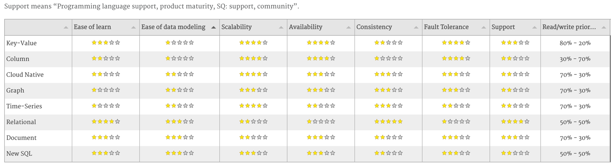
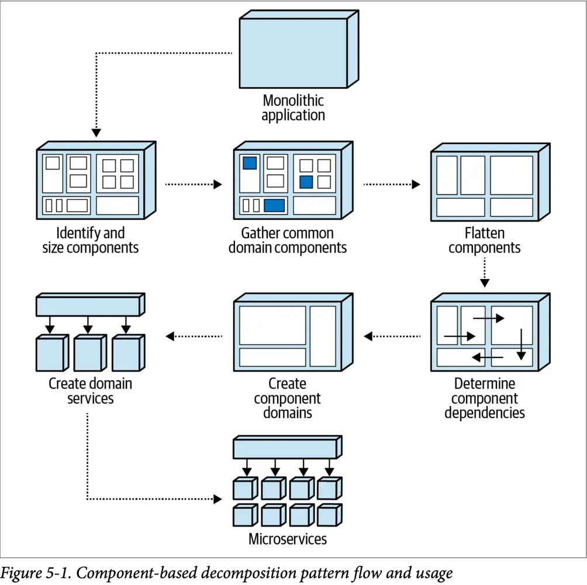
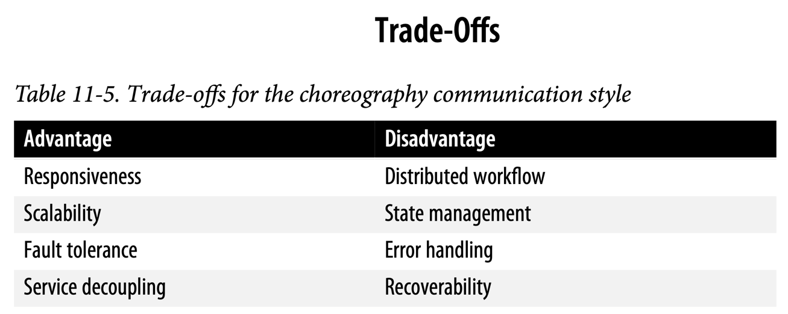
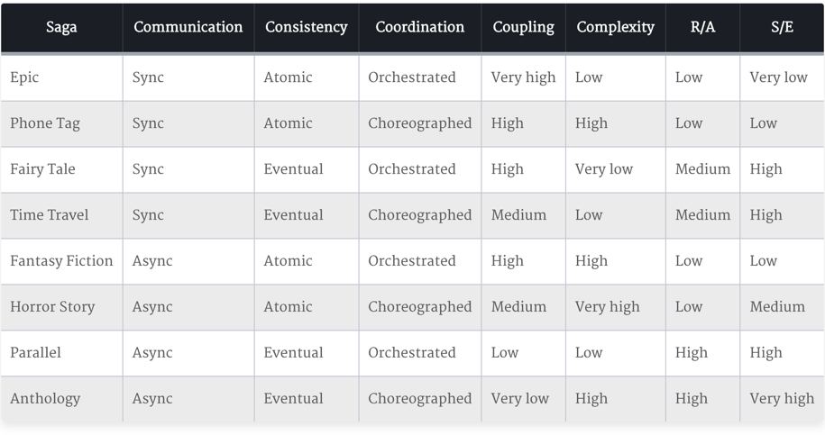

# Software Architecture: The Hard Parts by Neal Ford

**Key Quote:** "Software architecture is the stuff that’s hard to change later."

## ADRs (Architecture Decision Records)

* **Context:**  Briefly describe the problem and potential solutions.
* **Decision:**  Clearly state the chosen architectural decision with a detailed rationale.
* **Consequences:**  Discuss the impacts of the decision and the considered trade-offs.

## Modern Trade-off Analysis

1. **Identify Entanglement:** Determine what system parts are interconnected.
2. **Analyze Coupling:**  Understand how services interact.
3. **Assess Trade-offs:**  Evaluate the impact of change on dependent systems.

## Why Over How

Prioritize understanding the underlying rationale before implementation details.

## Coupling

* **Static Coupling:**  How services are linked.
* **Dynamic Coupling:**  How services interact at runtime.

**General Advice:**  Minimize cross-service transactions when possible.

## Part I: Putting Things Apart (structure)

* **Chapter 1: What Does an Architect Do?**
    * **Architects Shape Systems:** Influence software development through critical decisions.
    * **Tradeoffs are Central:** Navigating tradeoffs is at the heart of architecture.
    * **Communication is Key:**  Architects must effectively convey complex concepts.

* **Chapter 2: Evolutionary Architecture**
    * **Embrace Change:**  Architectures must be adaptable.
    * **Fitness Functions:**  Define quality attributes to guide decision-making.
    * **Incremental Change:**  Favor smaller, iterative improvements to manage risk.

* **Chapter 3: Architecting for Scale**
    * **It's Not Just About Technology:**  Consider people and processes alongside technology.
    * **Data is Often the Bottleneck:**   Storage and access need careful design for scalability.
    * **Premature Scaling is Risky:**  Focus on agility first.

* **Chapter 4: Modular Architectures**
    * **Small, Cohesive Modules:**  Promote reusability, independent development, and understanding.
    * **Strong Contracts, Loose Coupling:**  Prioritize clear interfaces, minimize internal
      dependencies.
    * **Encapsulation:** Keep the system maintainable by hiding implementation details.

* **Chapter 5: Microservices**
    * **Promises:** Modularity, scalability, and team autonomy.
    * **Complexities:**  Inherent challenges of distributed systems, logistical overhead, service
      boundaries.
    * **Not a Magic Solution:**  Carefully assess suitability based on team experience, system
      structure, and operational capacity.

* **Chapter 6: Pulling Apart Operational Data**
    * **Data Disintegrators:** Considerations when splitting a database into multiple smaller ones:
        * **Change Control:** Database changes can impact multiple services.
        * **Connection Management:** Monitor database connection limits.
        * **Scalability:** Data partitioning improves scalability.
        * **Fault Tolerance:** Avoid single points of failure.
        * **Architecture Quantum:** Evaluate the need for different database types.

    * **Data Integrators:** Challenges when databases span multiple services:
        * **Data Relationships:** Maintain referential integrity.
        * **Database Transactions:** Manage transactions across services.

    * **Steps to Splitting a Database**
        * **Analyze and Create Data Domains:** Discover logical groupings of data.
        * **Assign Tables:** Allocate tables to data domains.
        * **Allow Cross-Schema Joins:** Initially maintain connectivity.
        * **Separate Connections:** Isolate database connections per data domain.
        * **Replace Joins with Service Calls:** Refactor to service interactions.
        * **Move to Separate Servers:** Physically split databases.
        * **Cleanup:** Remove connections to the old database.

    * **Selecting Database Types:**
        * **Relational:** Best for structured data, complex queries, consistency needs.(MySQL, Oracle,
          Microsoft SQL Server, and PostgreSQL)
        * **Key-Value:** Simple data access with high read/write throughput.(Redis, DynamoDB, Riak KV)
        * **Document:** Rich document structures, multiple indexes.(MongoDB, CouchDB, Marklogic)
        * **Column Family(Wide column databases or big table databases):** High volume and
          high-performance needs.(Cassandra, Druid, Scylla)
        * **Graph:** Modeling highly connected data.(Neo4j, Infinite Graph, Tigergraph)
        * **NewSQL:** Scalability of NoSQL with ACID properties.(VoltDB, NuoDB, ClustrixDB)
        * **Cloud Native:** A mix of database solutions.(Snowflake, Amazon Redshift, Datomic, and Azure CosmosDB)
        * **Time-Series:** Optimized for time-based data.(InfluxDB, TimescaleDB)
          

* **Chapter 7: Service Granularity**
    * **Granularity == size == # of statements + # public interfaces.**
    * **Granularity disintegrators:**
        * Service Scope and Function:
            * Consider cohesion and size.
            * Single responsibility principle.
            * Subjective, so don’t use alone.
        * Code volatility: (frequency of changes)
            * If a component changes more frequently than others, consider to split it, so that deployment and testing
              scope is smaller.
        * Scalability and Throughput:
            * Some component needs to scale more than others.
        * Fault tolerance:
            * One component more likely to crash and affect other component.
        * Security:
            * Different security requirements per component.
        * Extensibility:
            * If a new functionality will be more appropriate as a new service.
    * **Granularity integrators:**
        * DB transactions.
        * Workflow and choreography:
            * Too many inter-service callas:
                * Less fault-tolerant.
                * Less performant.
        * Shared code (business code, not infrastructure).
        * Data relationships.

### ACID

**A**tomic – Each transaction is either properly carried out or the process halts and the database reverts back to the
state before the transaction started. This ensures that all data in the database is valid.
**C**onsistent – A processed transaction will never endanger the structural integrity of the database.
**I**solated – Transactions cannot compromise the integrity of other transactions by interacting with them while they
are still in progress.
**D**urable – The data related to the completed transaction will persist even in the cases of network or power outages.
If a transaction fails, it will not impact the manipulated data.

### BASE

**Ba**sically Available – Rather than enforcing immediate consistency, BASE-modelled NoSQL databases will ensure
availability of data by spreading and replicating it across the nodes of the database cluster.
**S**oft State – Due to the lack of immediate consistency, data values may change over time. The BASE model breaks off
with the concept of a database which enforces its own consistency, delegating that responsibility to developers.
**E**ventually Consistent – The fact that BASE does not enforce immediate consistency does not mean that it never
achieves it. However, until it does, data reads are still possible (even though they might not reflect the reality).

## Decomposition Strategies

* **Tactical Forking:**  Suitable for unstructured codebases. Duplicate services and then remove
  redundancy.
* **Component-Based Decomposition:**  Preferred when source code demonstrates clear, well-defined
  components.

## Component-based decomposition

1. **Identify and Size Components Pattern**
    * Not too big, not too small == ~ 1-2 standard deviation from average.
    * Size == # statements.
    * Too big –> split.
2. **Gather Common Domain Components Pattern**
    * To eliminate duplication.
    * Shared domain logic, not infrastructure.
    * Mostly a manual process.
3. **Flatten Components Pattern** The Flatten Components decomposition pattern is used to move
   orphaned classes to create well-defined components that exist only as leaf nodes of a directory
   or name‐ space, creating well-defined subdomains (root namespaces) in the process. **Regardless** of
   the direction of flattening, make sure source code files reside only in leaf node namespaces or
   directories so that source code can always be identified within a specific component.
4. **Determine Component Dependencies Pattern**
    * Coupling is the most significant factor in determining the overall success and feasibility of
      breaking a monolith.
    * Both afferent and efferent coupling.
    * Consider refactor to reduce coupling (like splitting a component in two).
5. **Create Component Domains Pattern**
    * Domains =~ service.
    * Package structure: ss.customer.billing.payments.MonthlyBilling,
      app.domain.subdomain.component.class
    * Move components to appropriate domain.
6. **Create Domain Services Pattern**
    * Service-based architecture.
    * Don’t apply this pattern until all domains have been identified and refactored.

## Part II: Putting Things Back together (communication)

* **Chapter 8 - Reuse Patterns**
    1. **Code replication:**
        * Copy and paste between services.
        * Use for simple static code that is unlikely to change.
    2. **Shared library:**
        * Trade-off between dependency management and change control.
        * In general, strive for fine-grained libraries.
        * Use in homogeneous environments where shared code change is low to moderate.

    3. **Shared service:**
        * Easier to deploy changes, but:
            * Less performance, scalable, fault tolerant.
            * Versioning can be more difficult.
        * Good in:
            * Polyglot environments.
            * High number of changes in shared functionality.
    4. **Sidecars and service mesh:**
        * Mostly for cross-cutting operational concerns.

    * **Reuse is derived via abstraction but operationalized by slow rate of change.**

* **Chapter 9 - Data Ownership and Distributed Transactions**
    * In general, the service that performs writes owns the data.
    * Scenarios:
        1. Simple ownership:
            * Only one writer.
            * Writer owns the data.
        2. Common ownership:
            * Most services write to the table.
            * Solution: create a new service that owns the data.
        3. Joint ownership:
            * Solutions:
                1. Split table:
                    * May required data replication/synchronization between services on delete/create of primary entity.
                2. Data domain techniques:
                    * Both services own the table, so keep as it is.
                3. Delegate techniques:
                    * One service owns the data, the other makes service calls.
                    * Consider owner by primary domain or by operational characteristic.
                4. Service consolidation technique:
                    * Combine possible owners in a bigger service.
    * Distribute transactions, eventual consistency patterns:
        1. Background synchronization pattern:
            * Separate external process or service that periodically check data sources and keeps them in sync.
            * Pro: no inter-service communication.
            * Cons:
                * Slow eventual consistency.
                * High coupling between sync process and all other processes.
            * Complex implementation.
        2. Orchestrated Request-Based Pattern:
            * One process/service in charge of making synchronous requests to other services.
            * Prefer a dedicated orchestrator.
            * Pro:
                * Services still decoupled, if orchestrator is standalone.
                * Favours consistency over availability.
                * Atomic business requests.
                * Cons:
                    * Slower responsiveness.
                    * Complex error handling.
                    * Usually requires compensating transactions.
        3. Event-based pattern:
            * Pro:
                * Decoupled services.
                * Fast data consistency.
                * Fast responsiveness.
            * Cons: very complex error handling.
* **Chapter 10 - Distributed Data Access**
    * Data access patterns:
        1. Inter-service calls.
            * Pro: Simple
            * Cons: performance, scalability, no fault tolerance, adds contract
        2. Column schema replication:
            * Keep local copy of the other service data.
            * Pros: performance, scalability, fault tolerance, no service deps
            * Cons: data consistency, data ownership, data sync is required
        3. Duplicated caching pattern:
            * Same as (2) but in-memory and using some product (Hazelcast, Ignite).
            * Pro: data remains consistent and ownership is preserved.
                * How much I disagree on this?
            * Cons: bad for volatile data, bad for high volume of data, startup latency
        4. Data domain pattern:
            * Share DB, same as joint ownership.
            * Pros: consistent data, no performance issues
            * Cons: security, data ownership is vague, broader bounded context
* **Chapter 11 - Managing Distributed Workflow**
    1. Orchestration communication style:
        * AKA mediator.
        * In microservices, one orchestrator per workflow.
        * Responsibilities:
            * Workflow state.
            * Optional behaviour.
            * Error handling.
            * Notification.
        * Pros: Centralized workflow, Error handling, Recoverability, State management
        * Cons: Responsiveness, Fault tolerance, Scalability, Service coupling
    2. Choreography communication style:
        * Workflow state management patterns:
            1. Front controller pattern(pseudo-orchestration):
                * First called service owns the state.
                * Other services may query and update the state.
            2. Stateless choreography:
                * Query individual services to know the state of the workflow.
            3. Stamp coupling:
                * Add workflow state in the message between services.
                * Each service updates its part.
                    * Pros: no controller, always available state
                    * Cons: large contract
        * 
    3. As workflow complexity goes up, the need for an orchestrator raises.
* **Chapter 12 - Transactional Sagas**
    * Types:
        * Epic saga:
            * “Traditional”.
            * Avoid.
        * Phone Tag:
            * Like Epic but without a coordinator.
        * Fairy Tale:
            * As Epic but without distributed transactions.
        * Fantasy Fiction:
            * To improve the Epic saga performance, but it fails.
        * Horror Story:
            * Building atomicity on top of async + no mediator.
    * R/A stands for Responsiveness/Availability.
    * S/E stands for Scale/Elasticity.
    * Consider state machines (instead of atomic distributed transactions) to know the current state of a transactional
      saga.
    * 
    * 