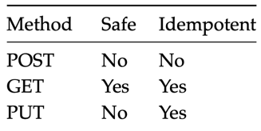

# Understanding_distributed_systems by Roberto Vitillo

### Part I - Communication

##### Chapter 1 - Intro

* “A distributed system is one in which the failure of a computer you didn’t even know existed can render your own
  computer unusable.”
* In software development, a leaky abstraction is an abstraction that leaks details that it is supposed to abstract
  away.

##### Chapter 2 - Reliable links

* Transmission Control Protocol **TCP**: Reliable Data Delivery
    * Breaks data into numbered segments.
    * Receiver checks for missing or out-of-order segments.
    * Segments require acknowledgement, otherwise they're resent.
    * Checksums ensure data arrives without corruption.
* **TCP** Handshake
    * 
* **UDP** User Datagram Protocol is a communication protocol used across the Internet for especially time-sensitive
  transmissions such as video playback or **DNS** lookups. It speeds up communications by not formally establishing a
  connection before data is transferred.

##### Chapter 3 - Secure links

* Transport Layer Security1 (**TLS**) protocol. **TLS** runs on top of **TCP** and encrypts the communication channel so
  that
  application layer protocols, like HTTP, can leverage it to communicate securely. In a nutshell, TLS provides
  encryption, authentication, and integrity.
* For a **TLS** certificate to be trusted by a device, the certificate, or one of its ancestors, must be present in the
  trusted store of the client. Trusted root **CAs**, such as Let’s Encrypt4, are typically included in the client’s
  trusted
  store by default by the operating system vendor.
    * 
* One of the most common mistakes when using **TLS** is letting a certificate expire.
* Hash-based message authentication code (or **HMAC**) is a cryptographic authentication technique that uses a hash
  function
  and a secret key. When a process receives a message, it recomputes the digest of the message and checks whether it
  matches the digest included in the message. If not, then the message has either been corrupted during transmission
  or has been tampered with. In this case, the message is dropped. The **TLS** **HMAC** protects against data corruption
  as
  well, not just tampering.
* You might be wondering how data can be corrupted if TCP is supposed to guarantee its integrity. While TCP does use a
  checksum to protect against data corruption, it’s not 100% reliable : it fails to detect errors for roughly 1 in 16
  million to 10 billion packets. With packets of 1 KB, this is expected to happen once per 16 GB to 10 TB transmitted.
* The bottom line is that creating a new connection is not free: yet another reason to put your servers geographically
  closer to the clients and reuse connections when possible.

##### Chapter 4 - Discovery

* The phone book of the internet: the Domain Name System1 (**DNS**) — a distributed, hierarchical, and eventually
  consistent key-value store.
* DNS resolution:
    1. The browser checks its local cache to see whether it has resolved the hostname before. If so, it returns
       the cached IP address; otherwise, it routes the request to a DNS resolver, a server typically hosted by your
       Internet
       Service Provider (ISP).
    2. The resolver is responsible for iteratively resolving the hostname for its clients. The reason why it’s
       iterative
       will become obvious in a moment. The resolver first checks its local cache for a cached entry, and if one is
       found,
       it’s returned to the client. If not, the query is sent to a root name server (root NS).
    3. The root name server maps the top-level domain (TLD) of the request, i.e., .com, to the address of the name
       server
       responsible for it.
    4. There solver sends a resolution request for example.com to the TLD name server.
    5. The TLD name server maps the example.com domain name to the address of the authoritative name server responsible
       for the
       domain.
    6. Finally,theresolverqueriestheauthoritativenameserverfor www.example.com, which returns the IP address of the www
       hostname.
* 
* How do these caches know when to expire a record? Every DNS record has a time to live (TTL) that informs the cache how
  long the entry is valid for.

##### Chapter 5 - API

* **HTTP** is a request-response protocol used to encode and transport information between a client and a server. When
  it runs on top of **TLS**, it’s also referred to as **HTTPS**.
* **HTTP 2** was designed from the ground up to address the main limitations of **HTTP 1.1**. It uses a binary protocol
  rather
  than a textual one, allowing it to multiplex multiple concurrent request-response transactions (streams) on the same
  connection.
* **HTTP 3** is the latest iteration of the HTTP standard, which is based on UDP and implements its own transport
  protocol
  to address some of TCP’s shortcomings10. For example, with **HTTP 2**, a packet loss over the **TCP** connection
  blocks all
  streams (**HOL**), but with **HTTP 3** a packet loss interrupts only one stream, not all of them.
* Request methods can be categorized based on whether they are safe and whether they are idempotent. A safe method
  should not have any visible side effects and can safely be cached. An idempotent method can be executed multiple
  times, and the end result should be the same as if it was executed just a single time. Idempotency is a crucial
  aspect of APIs, and we will talk more about it later in section
    *  
* REST APIs should be versioned to support breaking changes, e.g., by prefixing a version number in the URLs (
  /v1/products/). However, as a general rule of thumb, APIs should evolve in a backward-compatible way unless there
  is a very good reason. Although backward-compatible APIs tend not to be particularly elegant, they are practical.
* An effective way for clients to deal with transient failures such as these is to retry the request one or more times
  until they get a response back. Some HTTP request methods (e.g., PUT, DELETE) are considered inherently idempotent
  as the effect of executing multiple identical requests is identical to executing only one request, but You can see how
  this introduces a lot of complexity for the client. Instead of pushing this complexity to the client, a better
  solution would be for the server to create the product only once by making the POST request idempotent, so that no
  matter how many times that specific request is retried, it will appear as if it only executed once. (Add some UUID for
  idempotency key)

### Part II - Coordination

##### Chapter 6 - System models

* Similarly, we can model the behavior of processes based on the type of failures we expect to happen:
    * The arbitrary-fault model assumes that a process can deviate from its algorithm in arbitrary ways, leading to
      crashes or unexpected behaviors caused by bugs or malicious activity. For historical reasons, this model is also
      referred to as the “Byzantine” model. More interestingly, it can be theoretically proven that a system using this
      model can tolerate up to 1/3 of faulty processes1 and still operate correctly.
    * The crash-recovery model assumes that a process doesn’t deviate from its algorithm but can crash and restart at
      any time, losing its in-memory state.
    * The crash-stop model assumes that a process doesn’t deviate from its algorithm but doesn’t come back online if it
      crashes. Although this seems unrealistic for software crashes, it mod- els unrecoverable hardware faults and
      generally makes the algorithms simpler.

##### Chapter 7 - Failure detection

* The Ping/echo tactic detects a fault by sending ping messages to receivers regularly. If a receiver does not respond
  to the sender within a certain time period, the receiver is considered to be failed. The Heartbeat tactic detects a
  fault by listening to heartbeat messages from monitored components periodically.

##### Chapter 8 - Time

* The simplest possible **logical** clock is a counter, incremented before an operation is executed.
* A vector clock4 is a logical clock that guarantees that if a logical timestamp is less than another, then the former
  must have happened-before the latter.

##### Chapter 9 - Leader Election

##### Chapter 10 - Replication

* Consistency models:
    * Strong consistency;
    * Sequential consistency;
    * Eventual consistency.
* CAP theorem, which can be summarized as: “strong consistency, availability
  and partition tolerance: pick two out of three.” In reality, the choice really is only between strong
  consistency and availability, as network faults are a given and can’t be avoided.
* The stronger the consistency guarantee is, the higher the latency of individual operations must be.

##### Chapter 11 - Coordination avoidance

* eager reliable broadcast:One way to implement reliable broadcast is to have each process retransmit the message to the
  rest of the group the first time it is delivered 
* Gossip broadcast: The number of messages can be reduced by retransmitting a message only to a random subset of
  processes 
* Eventual consistency requires:
    * eventual delivery — the guarantee that every update applied at a replica is eventually applied at all replicas,
    * and convergence — the guarantee that replicas that have applied the same updates eventually reach the same
      state.
* **Strong** eventual consistency requires:
    * eventual delivery — the same guarantee as in eventual consistency,
    * and strong convergence — the guarantee that replicas that have executed the same updates have the same state (
      i.e., every update is immediately persisted).
* **Casual** consistency:
    * For many applications, causal consistency is “consistent enough” and easier to work with than eventual
      consistency.
    * Causal consistency is provably the strongest consistency model that enables building systems that are also
      available and partition tolerant.
* **Dynamo**-style data stores: When a client wants to write an entry to the data store, it sends the request to all N
  replicas in parallel but waits for an acknowledgment from just W replicas (a write quorum). Similarly, when a client
  wants to read an entry from the data store, it sends the request to all replicas but waits just for R replies (a read
  quorum) and returns the most recent entry to the client.
* Merkle Trees, or Hash Trees, is a construct used for generating hashes of large amounts of data. This works whether
  it’s a single large file, a lot of small files, or any scenario where we have a significant amount of data.Merkle
  Trees can be an efficient way to verify the integrity of large quantities of
  data.
* The **CALM** theorem states that a program has a consistent, coordination-free distributed implementation if and only
  if it is monotonic.
* CRDT - Conflict-free replicated data type
* “Clusters of Order-Preserving Servers” (**COPS**), a key-value store that delivers causal consistency across
  geographically distributed clusters.

##### Chapter 12 - Transactions