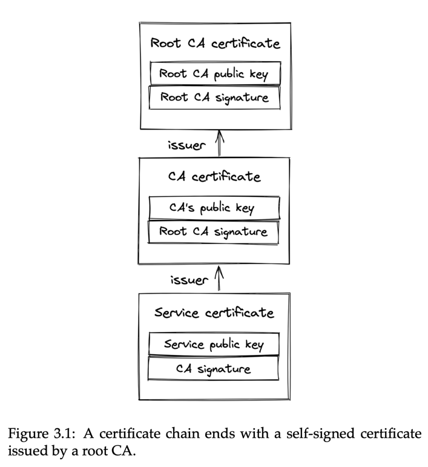

# Understanding_distributed_systems by Roberto Vitillo

##### Chapter 1 - Intro

* “A distributed system is one in which the failure of a computer you didn’t even know existed can render your own
  computer unusable.”
* In software development, a leaky abstraction is an abstraction that leaks details that it is supposed to abstract
  away.

##### Chapter 2 - Reliable links

* Transmission Control Protocol **TCP**: Reliable Data Delivery
    * Breaks data into numbered segments.
    * Receiver checks for missing or out-of-order segments.
    * Segments require acknowledgement, otherwise they're resent.
    * Checksums ensure data arrives without corruption.
* **TCP** Handshake
    * 
* **UDP** User Datagram Protocol is a communication protocol used across the Internet for especially time-sensitive
  transmissions such as video playback or **DNS** lookups. It speeds up communications by not formally establishing a
  connection before data is transferred.

##### Chapter 3 - Secure links

* Transport Layer Security1 (**TLS**) protocol. **TLS** runs on top of **TCP** and encrypts the communication channel so
  that
  application layer protocols, like HTTP, can leverage it to communicate securely. In a nutshell, TLS provides
  encryption, authentication, and integrity.
* For a **TLS** certificate to be trusted by a device, the certificate, or one of its ancestors, must be present in the
  trusted store of the client. Trusted root **CAs**, such as Let’s Encrypt4, are typically included in the client’s
  trusted
  store by default by the operating system vendor.
    * 
* One of the most common mistakes when using **TLS** is letting a certificate expire.
* Hash-based message authentication code (or **HMAC**) is a cryptographic authentication technique that uses a hash
  function
  and a secret key. When a process receives a message, it recomputes the digest of the message and checks whether it
  matches the digest included in the message. If not, then the message has either been corrupted during transmission
  or has been tampered with. In this case, the message is dropped. The **TLS** **HMAC** protects against data corruption
  as
  well, not just tampering.
* You might be wondering how data can be corrupted if TCP is supposed to guarantee its integrity. While TCP does use a
  checksum to protect against data corruption, it’s not 100% reliable : it fails to detect errors for roughly 1 in 16
  million to 10 billion packets. With packets of 1 KB, this is expected to happen once per 16 GB to 10 TB transmitted.
* The bottom line is that creating a new connection is not free: yet another reason to put your servers geographically
  closer to the clients and reuse connections when possible.

##### Chapter 4 - Discovery

* The phone book of the internet: the Domain Name System1 (**DNS**) — a distributed, hierarchical, and eventually
  consistent key-value store.
* DNS resolution:
    1. The browser checks its local cache to see whether it has resolved the hostname before. If so, it returns
       the cached IP address; otherwise, it routes the request to a DNS resolver, a server typically hosted by your
       Internet
       Service Provider (ISP).
    2. The resolver is responsible for iteratively resolving the hostname for its clients. The reason why it’s
       iterative
       will become obvious in a moment. The resolver first checks its local cache for a cached entry, and if one is
       found,
       it’s returned to the client. If not, the query is sent to a root name server (root NS).
    3. The root name server maps the top-level domain (TLD) of the request, i.e., .com, to the address of the name
       server
       responsible for it.
    4. There solver sends a resolution request for example.com to the TLD name server.
    5. The TLD name server maps the example.com domain name to the address of the authoritative name server responsible
       for the
       domain.
    6. Finally,theresolverqueriestheauthoritativenameserverfor www.example.com, which returns the IP address of the www
       hostname.
* 
* How do these caches know when to expire a record? Every DNS record has a time to live (TTL) that informs the cache how
  long the entry is valid for.

##### Chapter 5 - API

* **HTTP** is a request-response protocol used to encode and transport information between a client and a server. When
  it runs on top of **TLS**, it’s also referred to as **HTTPS**.
* **HTTP 2** was designed from the ground up to address the main limitations of **HTTP 1.1**. It uses a binary protocol
  rather
  than a textual one, allowing it to multiplex multiple concurrent request-response transactions (streams) on the same
  connection.
* **HTTP 3** is the latest iteration of the HTTP standard, which is based on UDP and implements its own transport
  protocol
  to address some of TCP’s shortcomings10. For example, with **HTTP 2**, a packet loss over the **TCP** connection
  blocks all
  streams (**HOL**), but with **HTTP 3** a packet loss interrupts only one stream, not all of them.
* Request methods can be categorized based on whether they are safe and whether they are idempotent. A safe method
  should not have any visible side effects and can safely be cached. An idem- potent method can be executed multiple
  times, and the end result should be the same as if it was executed just a single time. Idem- potency is a crucial
  aspect of APIs, and we will talk more about it later in section
  *  