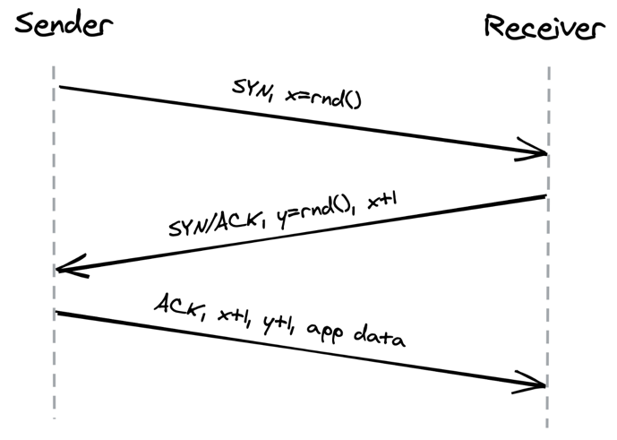
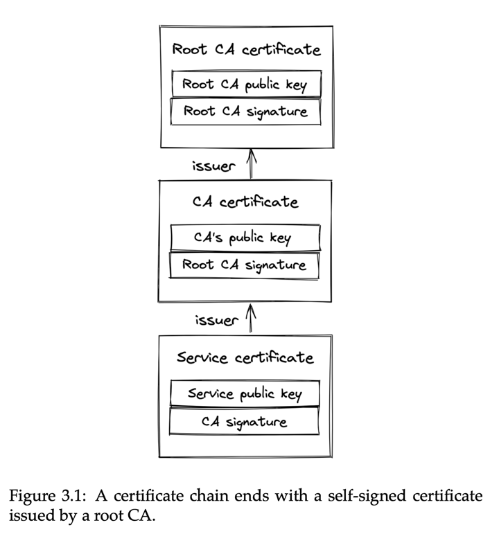
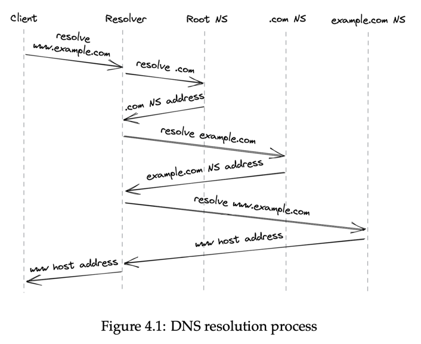
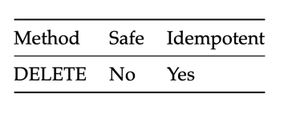
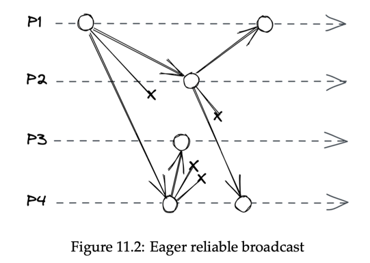
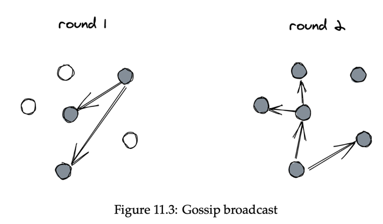
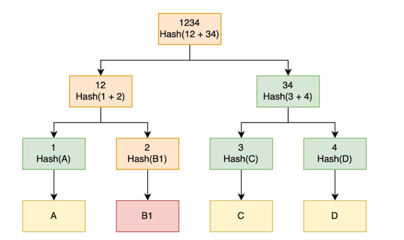
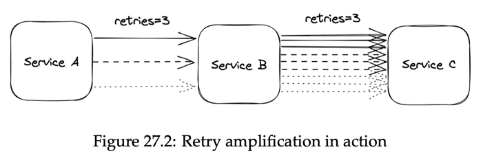

# Understanding_distributed_systems by Roberto Vitillo

8/10 - great for beginners, easy to read, wide scope

### Part I - Communication

##### Chapter 1 - Intro

* “A distributed system is one in which the failure of a computer you didn’t even know existed can render your own
  computer unusable.”
* In software development, a leaky abstraction is an abstraction that leaks details that it is supposed to abstract
  away.

##### Chapter 2 - Reliable links

* Transmission Control Protocol **TCP**: Reliable Data Delivery
    * Breaks data into numbered segments.
    * Receiver checks for missing or out-of-order segments.
    * Segments require acknowledgement, otherwise they're resent.
    * Checksums ensure data arrives without corruption.
* **TCP** Handshake
    * 
* **UDP** User Datagram Protocol is a communication protocol used across the Internet for especially time-sensitive
  transmissions such as video playback or **DNS** lookups. It speeds up communications by not formally establishing a
  connection before data is transferred.

##### Chapter 3 - Secure links

* Transport Layer Security1 (**TLS**) protocol. **TLS** runs on top of **TCP** and encrypts the communication channel so
  that
  application layer protocols, like HTTP, can leverage it to communicate securely. In a nutshell, TLS provides
  encryption, authentication, and integrity.
* For a **TLS** certificate to be trusted by a device, the certificate, or one of its ancestors, must be present in the
  trusted store of the client. Trusted root **CAs**, such as Let’s Encrypt4, are typically included in the client’s
  trusted
  store by default by the operating system vendor.
    * 
* One of the most common mistakes when using **TLS** is letting a certificate expire.
* Hash-based message authentication code (or **HMAC**) is a cryptographic authentication technique that uses a hash
  function
  and a secret key. When a process receives a message, it recomputes the digest of the message and checks whether it
  matches the digest included in the message. If not, then the message has either been corrupted during transmission
  or has been tampered with. In this case, the message is dropped. The **TLS** **HMAC** protects against data corruption
  as
  well, not just tampering.
* You might be wondering how data can be corrupted if TCP is supposed to guarantee its integrity. While TCP does use a
  checksum to protect against data corruption, it’s not 100% reliable : it fails to detect errors for roughly 1 in 16
  million to 10 billion packets. With packets of 1 KB, this is expected to happen once per 16 GB to 10 TB transmitted.
* The bottom line is that creating a new connection is not free: yet another reason to put your servers geographically
  closer to the clients and reuse connections when possible.

##### Chapter 4 - Discovery

* The phone book of the internet: the Domain Name System1 (**DNS**) — a distributed, hierarchical, and eventually
  consistent key-value store.
* DNS resolution:
    1. The browser checks its local cache to see whether it has resolved the hostname before. If so, it returns
       the cached IP address; otherwise, it routes the request to a DNS resolver, a server typically hosted by your
       Internet
       Service Provider (ISP).
    2. The resolver is responsible for iteratively resolving the hostname for its clients. The reason why it’s
       iterative
       will become obvious in a moment. The resolver first checks its local cache for a cached entry, and if one is
       found,
       it’s returned to the client. If not, the query is sent to a root name server (root NS).
    3. The root name server maps the top-level domain (TLD) of the request, i.e., .com, to the address of the name
       server
       responsible for it.
    4. There solver sends a resolution request for example.com to the TLD name server.
    5. The TLD name server maps the example.com domain name to the address of the authoritative name server responsible
       for the
       domain.
    6. Finally,theresolverqueriestheauthoritativenameserverfor www.example.com, which returns the IP address of the www
       hostname.
* 
* How do these caches know when to expire a record? Every DNS record has a time to live (TTL) that informs the cache how
  long the entry is valid for.

##### Chapter 5 - API

* **HTTP** is a request-response protocol used to encode and transport information between a client and a server. When
  it runs on top of **TLS**, it’s also referred to as **HTTPS**.
* **HTTP 2** was designed from the ground up to address the main limitations of **HTTP 1.1**. It uses a binary protocol
  rather
  than a textual one, allowing it to multiplex multiple concurrent request-response transactions (streams) on the same
  connection.
* **HTTP 3** is the latest iteration of the HTTP standard, which is based on UDP and implements its own transport
  protocol
  to address some of TCP’s shortcomings10. For example, with **HTTP 2**, a packet loss over the **TCP** connection
  blocks all
  streams (**HOL**), but with **HTTP 3** a packet loss interrupts only one stream, not all of them.
* Request methods can be categorized based on whether they are safe and whether they are idempotent. A safe method
  should not have any visible side effects and can safely be cached. An idempotent method can be executed multiple
  times, and the end result should be the same as if it was executed just a single time. Idempotency is a crucial
  aspect of APIs, and we will talk more about it later in section
    *  
* REST APIs should be versioned to support breaking changes, e.g., by prefixing a version number in the URLs (
  /v1/products/). However, as a general rule of thumb, APIs should evolve in a backward-compatible way unless there
  is a very good reason. Although backward-compatible APIs tend not to be particularly elegant, they are practical.
* An effective way for clients to deal with transient failures such as these is to retry the request one or more times
  until they get a response back. Some HTTP request methods (e.g., PUT, DELETE) are considered inherently idempotent
  as the effect of executing multiple identical requests is identical to executing only one request, but You can see how
  this introduces a lot of complexity for the client. Instead of pushing this complexity to the client, a better
  solution would be for the server to create the product only once by making the POST request idempotent, so that no
  matter how many times that specific request is retried, it will appear as if it only executed once. (Add some UUID for
  idempotency key)

### Part II - Coordination

##### Chapter 6 - System models

* Similarly, we can model the behavior of processes based on the type of failures we expect to happen:
    * The arbitrary-fault model assumes that a process can deviate from its algorithm in arbitrary ways, leading to
      crashes or unexpected behaviors caused by bugs or malicious activity. For historical reasons, this model is also
      referred to as the “Byzantine” model. More interestingly, it can be theoretically proven that a system using this
      model can tolerate up to 1/3 of faulty processes1 and still operate correctly.
    * The crash-recovery model assumes that a process doesn’t deviate from its algorithm but can crash and restart at
      any time, losing its in-memory state.
    * The crash-stop model assumes that a process doesn’t deviate from its algorithm but doesn’t come back online if it
      crashes. Although this seems unrealistic for software crashes, it mod- els unrecoverable hardware faults and
      generally makes the algorithms simpler.

##### Chapter 7 - Failure detection

* The Ping/echo tactic detects a fault by sending ping messages to receivers regularly. If a receiver does not respond
  to the sender within a certain time period, the receiver is considered to be failed. The Heartbeat tactic detects a
  fault by listening to heartbeat messages from monitored components periodically.

##### Chapter 8 - Time

* The simplest possible **logical** clock is a counter, incremented before an operation is executed.
* A vector clock4 is a logical clock that guarantees that if a logical timestamp is less than another, then the former
  must have happened-before the latter.

##### Chapter 9 - Leader Election

##### Chapter 10 - Replication

* Consistency models:
    * Strong consistency;
    * Sequential consistency;
    * Eventual consistency.
* CAP theorem, which can be summarized as: “strong consistency, availability
  and partition tolerance: pick two out of three.” In reality, the choice really is only between strong
  consistency and availability, as network faults are a given and can’t be avoided.
* The stronger the consistency guarantee is, the higher the latency of individual operations must be.

##### Chapter 11 - Coordination avoidance

* eager reliable broadcast:One way to implement reliable broadcast is to have each process retransmit the message to the
  rest of the group the first time it is delivered 
* Gossip broadcast: The number of messages can be reduced by retransmitting a message only to a random subset of
  processes 
* Eventual consistency requires:
    * eventual delivery — the guarantee that every update applied at a replica is eventually applied at all replicas,
    * and convergence — the guarantee that replicas that have applied the same updates eventually reach the same
      state.
* **Strong** eventual consistency requires:
    * eventual delivery — the same guarantee as in eventual consistency,
    * and strong convergence — the guarantee that replicas that have executed the same updates have the same state (
      i.e., every update is immediately persisted).
* **Casual** consistency:
    * For many applications, causal consistency is “consistent enough” and easier to work with than eventual
      consistency.
    * Causal consistency is provably the strongest consistency model that enables building systems that are also
      available and partition tolerant.
* **Dynamo**-style data stores: When a client wants to write an entry to the data store, it sends the request to all N
  replicas in parallel but waits for an acknowledgment from just W replicas (a write quorum). Similarly, when a client
  wants to read an entry from the data store, it sends the request to all replicas but waits just for R replies (a read
  quorum) and returns the most recent entry to the client.
* Merkle Trees, or Hash Trees, is a construct used for generating hashes of large amounts of data. This works whether
  it’s a single large file, a lot of small files, or any scenario where we have a significant amount of data.Merkle
  Trees can be an efficient way to verify the integrity of large quantities of
  data.
* The **CALM** theorem states that a program has a consistent, coordination-free distributed implementation if and only
  if it is monotonic.
* CRDT - Conflict-free replicated data type
* “Clusters of Order-Preserving Servers” (**COPS**), a key-value store that delivers causal consistency across
  geographically distributed clusters.

##### Chapter 12 - Transactions

* Distributed transaction is a lot more challenging to implement
* ACID - **Atomicity**, **Consistency**(a transaction can only transition a database from a correct state to another
  correct state), **Isolation**(the concurrent execution of transactions doesn’t cause any race conditions),
  **Durability**.
* Optimistic concurrency control8(OCC) is arguably the best-known protocol in the space. In OCC, a transaction writes to
  a local workspace without modifying the actual data store.
* Two-phase commit13 (2PC) is a protocol used to implement atomic transaction commits across multiple processes.

##### Chapter 13 - Asynchronous Transactions

* A common pattern1 in modern applications is to replicate the same data to different data stores tailored to different
  use cases.
* AWS Step Functions11 or Azure Durable Functions - sagas
* Semantic locks13. The idea is that any data the saga modifies is marked with a dirty flag, which is only cleared at
  the end of the transaction.
* One is that failures are unavoidable in distributed systems, and the other is that coordination is expensive.
* keeping coordination off the critical path, as chain replication does;
* proceeding without coordination and “apologize” when an inconsistency is detected, as sagas do;
* using protocols that guarantee some form of consistency without coordination, like CRDTs.

##### Chapter 14 - HTTP Caching

* To summarize, allowing clients to cache static resources has reduced the load on our server, and all we had to do
  was to play with some HTTP headers!
* A reverse proxy is a server-side proxy that intercepts all communications with clients. A common use case for a
  reverse proxy is to cache static resources returned by the server. Since the cache is shared among the clients, it
  will decrease the load of the server a lot more than any client-side cache ever could.

##### Chapter 15 - Content delivery networks

* Core routing protocol, BGP, was not designed with performance in mind. It primarily uses the number of hops to cost
  how expensive a pth is with respect to another, without considering their latencies or congestions.
* Global DNS load balancing4: an extension to DNS that considers the location of the client inferred from its IP, and
  returns a list of the geographically closest clusters taking into account also the network congestion and the
  clusters’ health.
* CDN servers are also placed at internet exchange points, where ISPs connect to each other.

##### Chapter 16 - Partitioning

* Partitioning is not a free lunch since it introduces a fair amount of complexity:
  • A gateway service is required to route requests to the right nodes.
  • To roll up data across partitions, it needs to be pulled from multiple partitions and aggregated (e.g., think of the
  complexity of implementing a “group by” operation across partitions).
  • Transactions are required to atomically update data that spans multiple partitions, limiting scalability.
  • If a partition is accessed much more frequently than others, the system’s ability to scale is limited.
  • Addingorremovingpartitionsatruntimebecomeschalleng- ing, since it requires moving data across nodes.
* Use hash partitioning

##### Chapter 17 - File storage

* Using CDNs enables our files to be quickly accessible by clients. However, our server will run out of disk space as
  the number of files we need to store increases. To work around this limit, we can use a managed file store such as AWS
  S3 or Azure Blob Storage. Managed file stores scalable, highly available & offer strong durability guarantees. In
  addition to that, managed file stores enable anyone with access to its URL to point to it, meaning we can point our
  CDNs to the file store directly.

##### Chapter 18 - Network load balancing

* Scaling out a stateless application doesn’t require much effort, assuming its dependencies can scale accordingly as
  well.
* **As a general rule of thumb, we should try to keep our applications stateless by pushing state to third-party
  services designed by teams with years of experience building such services. :)**
* The algorithms used for routing requests can vary from round robin(a competition in which all the players play against
  each other at least once) to consistent hashing to ones that take into
  account the servers’ load.
* The idea is to randomly pick two servers from the pool and route the request to the least-loaded one of the two. This
  approach works remarkably well in practice
* Watchdog - wakes up periodically and monitors the server’s health.
* The one use case where DNS is used in practice to load-balance is for distributing traffic to different data centers
  located in different regions (global DNS load balancing).
* Transport layer load balancing - a load balancer that operates at the TCP level of the network stack (aka **L4** load
  balancer).
* Virtual IP (VIP) addresses. A VIP, in turn, is associated with a pool of servers
* An application layer load balancer (aka **L7** load balancer15) is an HTTP reverse proxy that distributes requests
  over a pool of servers. The load balancer can do smart things with application traffic, like rate-limit requests based
  on HTTP headers, terminate TLS connections, or force HTTP requests belonging to the same logical session to be routed
  to the same backend server. The caveat is that sticky sessions can create hotspots, since some sessions can be much
  more expensive to handle than others.
* A L7 load balancer can be used as the backend of a L4 load balancer that load-balances requests received from the
  internet. Although L7 load balancers have more capabilities than L4 load balancers, they also have lower throughput,
  making L4 load balancers better suited to protect against certain DDoS attacks, like SYN floods.
* If the load balancer goes down, the application behind it does too.

##### Chapter 19 - Data storage

* We can increase the read capacity of the database by creating **replicas**. The most common way of doing that is with
  a leader-follower topology.
* One caveat of replication is that it only helps to scale out reads, not writes.
* **Partitioning** allows us to scale out a database for both reads and writes. Even though traditional (centralized)
  relational databases generally don’t support it out of the box, we can implement it at the application layer in
  principle.
*

##### Chapter 20 - Caching

* What’s important to remember is that caching is an optimization, and the system needs to survive without it at the
  cost of being slower.

##### Chapter 21 - Microservices

* We can hide the internal APIs behind a public one that acts as a facade, or proxy, for the internal services. The
  service that exposes this public API is called the API **gateway** (a reverse proxy).
* Gateway can **compose** api calls too, to reduce amount of call for client. But the data might be inconsistent, as
  updates might not have propagated to all services yet; in that case, the gateway will have to resolve this discrepancy
  somehow.
* The API gateway can **translate** from one IPC mechanism to another. For example, it can translate a RESTful HTTP
  request into an internal gRPC call.
* As the API gateway is a reverse proxy, it can also implement crosscutting functionality that otherwise would have to
  be part of each service. For example, it can cache frequently accessed resources or rate-limit requests to protect the
  internal services from being overwhelmed.
* One of the drawbacks of using an API gateway is that it can become a development bottleneck. Since it’s tightly
  coupled with the APIs of the internal services it’s shielding, whenever an internal
  API changes, the gateway needs to be modified as well. Another downside is that it’s one more service that needs to be
  maintained. It also needs to scale to whatever the request rate is for all the services behind it.

##### Chapter 22 - control planes and data planes

* The control plane is the part of a network that controls how data is forwarded, while the data plane is the actual
  forwarding process.
* Control plane should be consistent and data plane should be performant.
* The data plane needs to be designed to withstand control plane failures for the separation to be robust.
* If the control plane is temporarily unavailable, the data plane should continue to run with a stale configuration
  rather than stop. This concept is also referred to as **static** stability.
* Another way is to use a scalable file store, like Azure Storage or S3, as a buffer between the control plane and the
  data plane. The control plane periodically dumps its entire state to the file store regardless of whether it changed,
  while the data plane reads the state periodically from it. Although this approach sounds naive and expensive, it tends
  to be reliable and robust in practice. And, depending on the size of the state, it might be cheap too.

##### Chapter 23 - Messaging

* Another benefit is that messaging enables to process multiple messages within a single batch or unit of work. Most
  messaging brokers support this pattern by allowing clients to fetch up to N messages with a single read request.
  Although batching degrades the processing latency of individual messages, it dramatically improves the application’s
  throughput. So when we can afford the extra latency, batching is a no brainer.
* Ordering is just one of the many tradeoffs a broker needs to make, such as:
    * delivery guarantees, like at-most-once or at-least-once;
    * message durability guarantees;
    * latency;
    * messaging standards supported, like AMQP4;
    * support for competing consumer instances;
    * broker limits, such as the maximum supported size of messages.
* Consumer failures trigger message redelivery. To prevent infinite retries, a message counter can be used. Once the
  maximum retry limit is reached, the message is sent to a dead letter queue for later analysis, preventing data loss
  and improving consumer efficiency.
* Message brokers offer robustness as producers can keep sending messages even if consumers are unavailable. However,
  when consumers can't keep up, a backlog builds, creating a degraded system state. Backlogs grow over time, requiring
  more resources to drain. Monitoring average message waiting times helps detect and address backlogs before they become
  critical.
* Poisonous messages, repeatedly failing to process, can create backlogs and degrade consumers. Identifying message
  source allows filtering: messages from problematic sources can be sent to a low-priority queue, minimizing impact on
  healthy messages.
* Scalable applications rely on three key patterns: functional decomposition (separate services), partitioning (
  distributed data), and replication (redundancy). These patterns, combined with managed cloud services, offer a
  powerful foundation for building a wide range of scalable applications. While specific service names might differ
  between cloud providers, core functionalities like compute instances, load balancers, storage options, and messaging
  services remain consistent. This core, along with optimizations like caching, provides a solid base for building
  scalable applications.

#### Part IV - Resiliency

* “Anything that can go wrong will go wrong.” – Murphy’s law

##### Chapter 24 - Common failure causes

##### Chapter 25 - Redundancy

* Marc Brooker lists four prerequisites1:
    1. The complexity added by introducing redundancy mustn’t cost more availability than it adds.
    2. The system must reliably detect which of the redundant components are healthy and which are unhealthy.
    3. The system must be able to run in degraded mode.
    4. The system must be able to return to fully redundant mode.

##### Chapter 26 - Fault isolation

* The use of partitions for fault isolation is also referred to as the bulkhead pattern, named after the compartments of
  a ship’s hull.

##### Chapter 27 - Downstream resiliency

* In general, timeouts are a must-have for operations that can potentially never return, like acquiring a mutex.
* To avoid spamming requests from multiple client at the same time, we can introduce random jitter delay = 𝑟𝑎𝑛𝑑𝑜𝑚(0,
  𝑚𝑖𝑛(cap, initial-backoff ⋅ 2attempt))
* 

##### Chapter 28 - Upstream resiliency

* Load Shedding - When the server detects that it’s overloaded, it can reject incoming requests by failing fast and
  returning a response with status code 503 (Service Unavailable).
* Load Leveling - The idea is to introduce a messaging channel between the clients and the service. The channel
  decouples the load directed to the service from its capacity, allowing it to process requests at its own pace.
* Rate-limiting - or throttling, is a mechanism that rejects a request when a specific quota is exceeded. A service can
  have multiple quotas, e.g., for the number of requests or bytes received within a time interval.

##### Chapter 29 - Testing

* A unit test should:
    * use only the public interfaces of the **SUT** (System under test);
    * test for state changes in the SUT (not predetermined sequences of actions);
    * test for behaviors, i.e., how the SUT handles a given input when it’s in a specific state.

#### Chapter 30 - Continuous delivery and deployment

* Terraform allows the provisioning of infrastructure to be automated and infrastructure changes to be treated just like
  any other software change. **Infrastructure as code.**
* The pipeline should allow enough time to pass between one step and the next **(bake time)** to ensure that it was
  successful, as some issues only appear after some time has passed

#### Chapter 31 - Monitoring

* A common black-box approach is to periodically run scripts (synthetics) that send test requests to external API
  endpoints and monitor how long they took and whether they were successful.
* For example, if the DNS server of a service were down, the issue would be visible to synthetics, since they wouldn’t
  be able to resolve its IP address. However, the service itself would think everything was fine, and it was just
  getting fewer requests than usual.
* To optimize metrics gathering - If the aggregation (i.e., the sum in our example) were to happen with a period of one
  hour, we would have one failureCount metric per serviceRegion, each containing one sample per hour, e.g.:
  "00:00", 561,
  "01:00", 42,
  "02:00", 61,
* A service-level objective (**SLO**) defines a range of acceptable values for an SLI within which the service is
  considered
  to be in a healthy state
* Service-level indicators (**SLIs**). An SLI is a metric that measures one aspect of the level of service provided by a
  service to its users, like the response time, error rate, or through- put. SLIs are typically aggregated over a
  rolling time window and represented with a summary statistic, like an average or percentile.
* Alerting is the part of a monitoring system that triggers an action when a specific condition happens, like a metric
  crossing a threshold.
* **SLO** is a good candidate for an alert because it quantifies the impact on the users.

#### Chapter 32 - Observability

* A distributed system is never 100% healthy since, at any given time, there is always something failing.
* Traces allow developers to:
  • debug issues affecting very specific requests, which can be used to investigate failed requests raised by customers
  in support tickets;
  • debug rare issues that affect only an extremely small fraction of requests;
  • debug issues that affect a large fraction of requests that have something in common, like high response times for
  requests that hit a specific subset of service instances;
  • identify bottlenecks in the end-to-end request path;
  • identify which users hit which downstream services and in what proportion (also referred to as resource
  attribution), which can be used for rate-limiting or billing purposes.

#### Chapter 33 - Manageability

* remote config simply