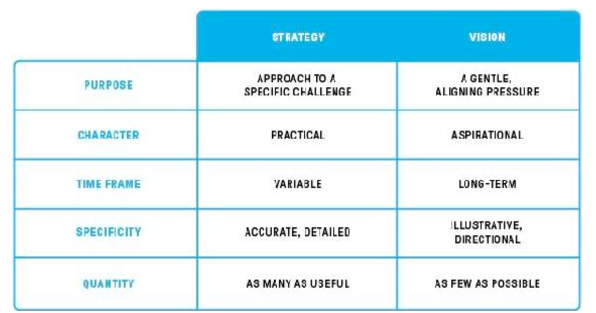

# An Elegant Puzzle Systems of Engineering Management Will Larson

#### Organizations

* Manager should support six to eight engineers.
* Tech Lead Managers - managers supporting fewer than four engineers tend to function as TLMs, taking on a share of
  design and implementation work.
* Managers supporting more than eight or nine engineers typically act as coaches adn safety nets for problems. They are
  to busy to actively invest in their team or their teams area of responsibility.
* Managers of managers should support four to six managers.
* On-call rotations want a team of at least eight engineers to rotate efficiently.
* Small teams (fewer than four members) are not teams.
* To create a new team, grow an existing team to eight to ten, and then into two teams of four or five.

* Four states of team:
    * 
        * Falling behind - backlog grows;
        * Treading water - critical work done, techdebt - no; WIP - work in progress
        * Repaying techdebt - they are able to start repaying debt and beginning to benefit from debt repayment
          snowball:
          each piece of debt you repay leads to more time to repay more debt.
    * 

* More engineers, more problems
* To make progress, above all else, you must ensure that some of your projects **finish**.
* Succession planning:
    * What do you do?:
        * in a meetings during a week?
        * look back for recurring processes
        * how do you support individuals?
        * audit communication channels that provide questions coming your way.
        * analyze your to-do list over past six month
        * think through external relations that is important for your work\
    * Now cross out things that can readily be done by other people.
    * Split what has left into 2 sections: easy(take less than 1 day to learn) and hard(where you are uniquely valuable
      for company)
    * Write a plan to close all of these easy gaps and few hard.
    * You can even get a 2-3 week vacation to find out what you missed.

#### Tools

* In management, change is a catalyst of complexity
* **Insight maker** is tool for modeling systems
* Product management: 
* Problem discovery: User's pain, User's purpose, benchmark, cohorts of users, competitive advantages, competitive
  moats(An economic moat is a metaphor that refers to businesses being able to maintain a competitive advantage over
  their competitors in order to preserve market share and profits), Compounding leverage.
* Problem selection: Surviving the round, Surviving the next round, winning rounds, consider different timeframes,
  industry trends, return on investment, experiments to learn
* Solution validation: Write a customer letter, Identify prior art (safer to rely ion people you know, because info from
  conference is usually misleading), Find reference users, Prefer experimentation over analysis, Find the path more
  quickly travelled, justify switching consts.
* Strategies are grounded documents which explain the trade-off and actions that will be take to address the specific
  challenge.
* Visions are aspirational documents that enable individuals that don't work closely together to make decisions that fit
  together cleanly.
* 
* Good goal: 
* An **SLO** (service level objective) is an agreement within an SLA about a specific metric like uptime or response
  time.
* OKRs stand for objectives and key results, a goal-setting framework that can help your team set and track measurable
  goals.
* Running good migrations: de-risk, enable, finish.
* **Finish**: start by stopping bleeding, which ensures that all newly added code uses new approach.
* Planning reorg: 
* Management style: Model, Document, Share
* Model: Start measuring team health and speed to have a baseline before your changes. Then start applying changes as an
  experiment and have a courage to proceed enough and to stop when it its needed.
* Document: Document your approach as detailed as possible, and check if it makes sense for other teams.
* Share: Just present it via email or so. Don't require to stick to it for now.
* You will spend much time refining your approach, then documenting it and likely almost no time in adoption.
* Compared to Mandate approach (It's better to adopt good enough approach quickly) Model is it's better to adopt great
  approach slowly, so if you don't have much capacity to adopt new approaches Model is better.
* To solve inconsistency among teams Decision making group can be created (Core)
* To know when core will be good, we need to know what is positive and negative freedoms
* Positive freedom: is for example to be able to choose what programming language to use.
* Negative freedom: is for example not to be obligated to support a programming language you don't like, but other teams
  need it.
* Questions for core:
    * How will they influence results? Will they rely on natural authority of individuals or have an authority as a
      team?
    * How will other teams interact with core?
    * How large this team should be?
    * How much time members will spend working in core?
    * Should members view their main role as a core member or continue identify themselves as their prev team?
    * How will you select members for group?
    * How long will members serve?
    * How representative this group will be? This helps to avoid decisions with low skill in area.
* Fail modes for core:
    * Domineering groups significantly decrease individuals freedoms.
    * Bottlenecked groups are helpful, but can't do as much as they want to.
    * Status-oriented is being in a core makes more sense than actual contribute
    * Inert - typically group is too busy with other stuff except core.
* Presentation to senior leadership is a bit of a dark art.
    * Communication is company-specific.
    * Start with the conclusion.
    * Frame why the topic matters.
    * Everyone loves a narrative. Like "last year we had a trouble with ..., and we need this to fix ..., and it will be
      done till ..."
    * Prepare for detours.
    * Answer directly. Instead of hiding problems, use them to share how you are going to deal with them.
    * Deep in data.
    * Derive actions from principles.
    * Be ready to discuss the details.
    * Prepare a lot, practice a little.
    * Make a clear ask.
    * Tie topic to business area to make them care.
* Time management:
    * Quarterly time retrospective: figure out how you invested your time.
    * Prioritize long-term success over short-term quality.
    * Finish small leveraged things.
    * Size backward, not forward: Specify the number of hours instead of specifying the volume of work.
    * Delegate working "in the system"
    * Trust the system you've built.
    * Decouple participation from productivity
    * Hire until you are slightly ahead of growth.
    * Use calendar blocking.
    * Getting admin support
