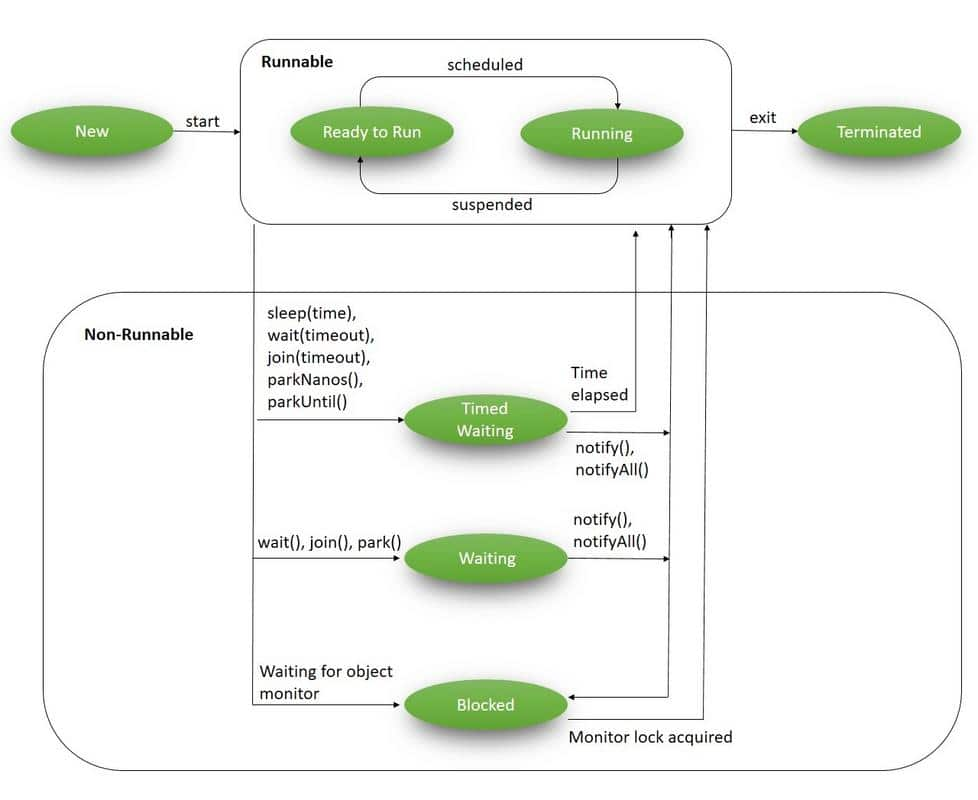

## Java Concurrency in Practice

by Brian Goetz

#### Chapter 1: Introduction

* *Safety* means "nothing bad ever happens," while *liveness* means "something good eventually happens."
* Compromising safety often means compromising correctness. An example is a race condition between multiple threads.
* A liveness failure in a single-threaded program can be an infinite loop. In a multithreaded program, it could be
  deadlock, starvation, or livelock.
* While liveness means that something good *eventually* happens, performance means that it will happen *quickly*.
* Context switches have significant costs, including saving and restoring execution context, less of locality, and
  spending CPU time on scheduling threads instead of running them.

#### Chapter 2: Thread Safety

* Writing thread-safe code is, at its core, about managing access to shared, mutable state.
* Whenever more than one thread accesses a given state variable, and one of them might write to it, they all must
  coordinate their access to it using synchronization.
* A broken program shares mutable state without synchronization. Either don't share the state, make it immutable, or use
  synchronization upon every access.
* It is far easier to design a class to be thread-safe than to retrofit it for safety later.
* The same object-oriented techniques that help you write well-organized, maintainable classes -- such as encapsulation
  and data hiding -- can also help you create thread-safe classes.
* A program that consists entirely of thread-safe classes may not be thread-safe, and a thread-safe program may contain
  classes that are not thread-safe.

##### 2.1: What is thread safety?

* A class is thread-safe if it behaves correctly when accessed from multiple threads, regardless of their scheduling or
  interleaving of execution, and with no additional synchronization or coordination by the calling code.
* Thread-safe classes encapsulate any needed synchronization so that clients need not provide their own.

##### 2.2: Atomicity

* A race condition occurs when the correctness of a computation depends on the relative timing or interleaving of
  multiple threads.
* The most common type of race condition is *check-then-act*, where an observation could have become invalid between the
  time you observed it and the time you acted on it, causing a problem.
* Read-modify-write operations require knowing a previous value and ensuring that no one else changes or uses that value
  while you are in mid-update.
* Check-then-act and read-modify-write sequences are compound actions, or sequences that must be executed atomically in
  order to remain thread-safe.

##### 2.3: Locking

* Mutual exclusion locks, or mutexes, means that at most one thread may own a lock. If thread A attempts to acquire a
  lock by thread B, it blocks until B releases it.
* Reentrancy means that locks are acquired on a per-thread rather than per-invocation basis. Each lock is associated
  with an acquisition count and an owning thread.

##### 2.4: Guarding state with locks

* For each mutable state variable that may be accessed by more than one thread, all accesses to that variable must be
  performed by the same lock held. The variable is *guarded* by the lock.
* When a class has invariants that involve more than one state variable, we must ensure that each variable participating
  in the invariant must be guarded by the same lock.

##### 2.5: Liveness and performance

* Acquiring and releasing a lock has some overhead, so do not break down guarded blocks too far, even if this would not
  compromise atomicity.
* When implementing a synchronization policy, resist the temptation to prematurely sacrifice simplicity (potentially
  compromising safety) for the sake of performance.
* Avoid holding locks during lengthy computations or operations at risk of not completing quickly, such as when
  performing disk or network I/O.

#### Chapter 3: Sharing Objects

##### 3.1: Visibility

* To ensure visibility of memory writes across threads, you must use synchronization.
* There is no guarantee that operations in one thread will be performed in the order given by the program, as long as
  the reordering is not detectable from within *that* thread.
* Because of reordering, attempts to reason about the order in which memory actions "must" happen in insufficiently
  synchronized multithreaded programs will almost certainly be incorrect.
* Unless synchronization is used every time a variable is accessed, it is possible for a thread to read a stale value
  for that variable.
* Stale data can cause serious and confusing failures such as unexpected exceptions, corrupted data structures,
  inaccurate computations, and infinite loops.
* *Out-of-thin-air safety* is when a variable reads a thread without synchronization, it reads a value that was actually
  written by another thread instead of some random value.
* With the Java Memory Model, the values of variables that were visible to thread A prior to releasing a lock are
  guaranteed to be visible to thread B upon acquiring the same lock.
* Variables marked with the `volatile` keyword are not reordered with other memory operations, and are not put in caches
  where they are hidden from other processors.
* A `volatile` variable can be used for a completion, interruption, or status flag, but the semantics are not strong
  enough to make the increment operation atomic, for example.
* Locking is not just about mutual exclusion; it is also about memory visibility. To ensure that all threads see the
  most up‐ to‐date values of shared mutable variables, the reading and writing threads must synchronize on a common
  lock.
* The semantics of `volatile` are not strong enough to make the increment operation (count++) **atomic**, unless you can
  guarantee that the variable is written only from a **single** thread.
* You can use volatile variables only when all the following criteria are met:
  • Writes to the variable do not depend on its current value, or you can ensure that only a single thread ever updates
  the value;
  • The variable does not participate in invariants with other state variables; and
  • Locking is not required for any other reason while the variable is being accessed.

##### 3.2: Publication and escape

* *Publishing* an object means making it available to code outside of its current scope. An object that is published
  when it should not have been is said to have *escaped*.
* Any object that is *reachable* from a published object by following some chain of nonprivate field references and
  method calls has also been published.
* Once an object escapes, you have to assume that another class or thread may, maliciously or carelessly, misuse it.
  This is a compelling reason to use encapsulation.
* An object is in a predictable, consistent state only after its constructor returns, so publishing an object (
  via `this`) from within its constructor can publish an incompletely constructed object.
* You can avoid this improper construction by using a private constructor and a public static factory method.

##### 3.3: Thread confinement

* If data is only accessed by a single thread, then no synchronization is needed. This technique is called *thread
  confinement*.
* *Ad-hoc thread confinement* is when the responsibility for maintaining thread confinement falls entirely on the
  implementation.
* Thread confinement is often a consequence of deciding to implement a particular subsystem, such as the GUI, as a
  single thread. The simplicity benefit of such a system outweighs the fragility of ad-hoc thread confinement.
* *Stack confinement* is a special case of thread confinement in which an object can only be reached through local
  variables. Local variables are intrinsically confined to the executing thread.

##### 3.4: Immutability

* Immutable objects are simple, because they can only have one state. Immutable objects are also safe, because you can
  freely share and publish them without the need to make defensive copies.
* An object is immutable if its state cannot be modified after construction, all its fields are `final`, and it is
  properly constructed, i.e. the `this` reference does not escape during construction.
* Whenever a group of related data items but be acted upon atomically, consider creating an immutable holder class for
  them.

##### 3.5: Safe publication

* Simply storing a reference to an object into a public field is not enough to publish that object safely. Improper
  publication allows another thread to observe a partially constructed object.
* However, immutable objects can be used safely by any thread without additional synchronization, even when
  synchronization is not used to publish them.
* To publish an object safely, both the reference to the object and the object's state must be made visible to other
  threads at the same time.
* Objects that are not technically immutable, but whose state will not be modified after publication, are called
  *effectively immutable*. Such objects, when safely published, can be used safely by any thread without additional
  synchronization.
* While effectively immutable objects must be safely published, mutable objects must be safely published, and mus the
  either thread-safe or guarded by a lock.
* Many concurrency errors stem from failing to understand the "rules of engagement" for a shared object. When you
  publish an object, document how it should be accessed.

###### 3.5.3. Safe Publication Idioms

* To publish an object safely, both the reference to the object and the object's state must be made visible to other
  threads at the same time. A properly constructed object can be safely published by:
  • Initializing an object reference from a static initializer;
  • Storing a reference to it into a volatile field or AtomicReference;
  • Storing a reference to it into a final field of a properly constructed object; or
  • Storing a reference to it into a field that is properly guarded by a lock.
* The ConcurrentHashMap class is similar to HashMap, except it’s thread-safe and allows modification while iterating
  over it.

###### 3.5.4. Effectively Immutable Objects

* Static initializers are executed by the JVM at class initialization time; because of internal synchronization in the
  JVM, this mechanism is guaranteed to safely publish any objects initialized in this way
* Safely published effectively immutable objects can be used safely by any thread without additional synchronization.

###### 3.5.5. Mutable Objects

* The publication requirements for an object depend on its mutability:
  • Immutable objects can be published through any mechanism;
  • Effectively immutable objects must be safely published;
  • Mutable objects must be safely published, and must be either thread‐safe or guarded by a lock.

###### 3.5.6. Sharing Objects Safely

* The most useful policies for using and sharing objects in a concurrent program are:
  **Thread‐confined.** A thread‐confined object is owned exclusively by and confined to one thread, and can be modified
  by its owning thread.
  **Shared read‐only.** A shared read‐only object can be accessed concurrently by multiple threads without additional
  synchronization, but cannot be modified by any thread. Shared read‐only objects include immutable and effectively
  immutable objects.
  **Shared thread‐safe.** A thread‐safe object performs synchronization internally, so multiple threads can freely
  access it through its public interface without further synchronization.
  **Guarded.** A guarded object can be accessed only with a specific lock held. Guarded objects include those that are
  encapsulated within other thread‐safe objects and published objects that are known to be guarded by a specific lock.

#### Chapter 4: Composing Objects

##### 4.1: Designing a thread-safe class

* Designing a thread-safe class requires identifying the invariants that constrain the state variables, and establishing
  a policy for managing concurrent access to them.
* The smaller the *state space* of an object or variable, the easier it is to reason about. Use `final` fields to reduce
  the state space.
* Operations with state-based preconditions are called *state-dependent*.
* Ownership implies control, but once you publish a reference to a mutable object, you no longer have exclusive control,
  but at best "shared ownership."

##### 4.2: Instance confinement

* Encapsulating data within an object confines access to the data to the object's methods, making it easier to ensure
  that the data is always accessed with the appropriate lock held.
* Instance confinement also allows different state variables to be held by different locks.
* Confined objects can also escape by publishing other objects such as iterators or inner class instances that may
  indirectly publish the confined objects.
* Using a private lock prohibits client code from acquiring it, whereas a publicly accessible lock allows client code to
  participate in its synchronization policy, perhaps incorrectly.

##### 4.3: Delegating thread safety

* A class with multiple independent thread-safe state variables and no operations that have any invalid state
  transitions can delegate thread safety to the underlying state variables.
* If a state variable is thread-safe, does not participate in any invariants that constrain its value, and has no
  prohibited state transitions for any of its operations, then it can be safely published.

##### 4.4: Adding functionality to existing thread-safe classes

* Extending a class to support a thread-safe operation is more fragile than adding code directly to the class, as its
  synchronization policy is now distributed over multiple source files.
* Just as subclassing violates encapsulation of implementation, client-side locking violates encapsulation of
  synchronization policy.

##### 4.5: Documenting synchronization policies

* Document a class's thread safety guarantees for its clients; document its synchronization policy for its maintainers.
* If you want clients to be able to create new atomic operations on your class, you must document which locks they
  should acquire to do so safely.
* If you must guess whether a class is thread-safe, improve the quality of your guess by interpreting the specification
  by someone who must implement it versus someone who will merely use it.
* Atomic ref is almost the same with `volatile` but with more useful methods.

#### Chapter 5: Building Blocks

* Synchronized collections should be sync more for every compound operation like `getLastElement`

##### 5.2: Concurrent Collections

* Replacing synchronized collections with concurrent collections can offer dramatic scalability improvements with little
  risk.
* **Lock striping** is a technique where the locking occurs on several buckets or stripes, meaning that accessing a
  bucket only locks that bucket and not the entire data structure. `ConcurrentHashMap` is an example.
* Only if your application needs to lock the map for exclusive access is `ConcurrentHashMap` not an appropriate drop‐in
  replacement.
* Since a `ConcurrentHashMap` cannot be locked for exclusive access, we cannot use client‐side locking to create new
  atomic operations such as put‐if‐absent.
* `Work stealing` can be more scalable than a traditional producer‐consumer design because workers don't contend for a
  shared work queue; most of the time they access only their own deque, reducing contention. When a worker has to access
  another's queue, it does so from the tail rather than the head, further reducing contention.

##### 5.5: Synchronizers

* Latches: a latch acts as a gate: until the latch reaches the terminal state the gate is closed and no thread can pass,
  and in the terminal state the gate opens, allowing all threads to pass.
* Futures: is like futures everywhere
* Semaphore: used to control the number of activities that can access a certain resource or perform a given action at
  the same time.
* Barriers: latches are for waiting for events; barriers are for waiting for other threads.

#### Summary of Part I

* It's the mutable state, stupid.
* All concurrency issues boil down to coordinating access to mutable state. The less mutable state, the easier it is to
  ensure thread safety.
* Make fields final unless they need to be mutable.
* Immutable objects are automatically thread‐safe.
* Immutable objects simplify concurrent programming tremendously. They are simpler and safer, and can be shared freely
  without locking or defensive copying.
* Encapsulation makes it practical to manage the complexity.
* You could write a thread‐safe program with all data stored in global variables, but why would you want to?
  Encapsulating data within objects makes it easier to preserve their invariants; encapsulating synchronization within
  objects makes it easier to comply with their synchronization policy.
* Guard each mutable variable with a lock.
* Guard all variables in an invariant with the same lock.
* Hold locks for the duration of compound actions.
* A program that accesses a mutable variable from multiple threads without synchronization is a broken program.
* Don't rely on clever reasoning about why you don't need to synchronize.
* Include thread safety in the design processor explicitly document that your class is not thread‐safe.
* Document your synchronization policy.

#### 6.1. Executing Tasks in Threads

* meh, the sequential approach suffers from poor responsiveness and throughput, and the thread‐per‐task approach suffers
  from poor resource management.

#### 6.2. The Executor Framework

* Using an Executor is usually the easiest path to implementing a producer‐consumer design in your application.

##### 6.2.4. Executor Lifecycle

* JVM can't exit until all the (non‐daemon) threads have terminated, so failing to shut down an Executor could prevent
  the JVM from exiting.

#### Chapter 7. Cancellation and Shutdown

* There is nothing in the API or language specification that ties interruption to any specific cancellation semantics,
  but in practice, using interruption for anything but cancellation is fragile and difficult to sustain in larger
  applications.
* Calling interrupt does not necessarily stop the target thread from doing what it is doing; it merely delivers the
  message that interruption has been requested.
* You can also override `interrupt` method to cancel everything needed in your custom thread.
* Sensible encapsulation practices dictate that you should not manipulate a thread ‐ interrupt it, modify its priority,
  etc. ‐ unless you own it. a poison pill: a recognizable object placed on the queue that means "when you get this,
  stop." With a FIFO queue, poison pills ensure that consumers finish the work on their queue before shutting down
* Daemon threads are **not** a good substitute for properly managing the lifecycle of services within an application.
* Avoid finalizers.

#### Chapter 8. Applying Thread Pools

* Some tasks have characteristics that require or preclude a specific execution policy. Tasks that depend on other tasks
  require that the thread pool be large enough that tasks are never queued or rejected; tasks that exploit thread
  confinement require sequential execution. Document these requirements so that future maintainers do not undermine
  safety or liveness by substituting an incompatible execution policy.
* allowCoreThreadTimeOut allows you to request that all pool threads be able to time out; enable this feature with a
  core size of zero if you want a bounded thread pool with a bounded work queue but still have all the threads torn down
  when there is no work to do.
* Sequential loop iterations are suitable for parallelization when each iteration is independent of the others and the
  work done in each iteration of the loop body is significant enough to offset the cost of managing a new task.

#### Chapter 9. GUI Applications

* In the old days, GUI applications were single‐threaded and GUI events were processed from a "main event loop". Modern
  GUI frameworks use a model that is only slightly different: they create a dedicated event dispatch thread (EDT) for
  handling GUI events.
* The Swing single‐thread rule: Swing components and models should be created, modified, and queried only from the
  event‐dispatching thread.
* Consider a split‐model design when a data model must be shared by more than one thread and implementing a thread‐ safe
  data model would be inadvisable because of blocking, consistency, or complexity reasons.
* GUI frameworks are nearly always implemented as single‐threaded subsystems in which all presentation‐related code runs
  as tasks in an event thread. Because there is only a single event thread, long‐running tasks can compromise
  responsiveness and so should be executed in background threads. Helper classes like SwingWorker or the BackgroundTask
  class built here, which provide support for cancellation, progress indication, and completion indication, can simplify
  the development of long‐running tasks that have both GUI and non‐GUI components.

#### Chapter 10: Avoiding Liveness Hazards

##### 10.1: Deadlock

* When thread A holds lock L and tries to acquire lock M, but at the same time thread B holds lock M and tries to
  acquire L, this is deadlock, or *deadly embrace*.
* When a database system detects that a set of transactions has deadlocked by searching the is-waiting-for graph for
  cycles, it picks a victim and aborts that transaction, thereby releasing its held locks.
* A program will be free of lock-ordering deadlocks if all threads acquire the locks they need in a fixed global order.
  Sometimes we must induce this ordering.
* Invoking an alien method with a lock held is asking for liveness trouble. That method might risk deadlock by acquiring
  other locks, or block for an unexpectedly long time and stall other threads on the held lock.
* Calling a method with no locks held is called an *open call*, and classes that rely on open calls are more
  well-behaved and composable than classes that make calls with locks held.
* Resource deadlocks occur when thread A holds resource X and tries to acquire resource Y, but at the same time thread B
  holds resource Y and tries to acquire resource X.

##### 10.2: Avoiding and diagnosing deadlocks

* Try acquiring locks with a timeout. By using a timeout that is much longer than you expect acquiring the lock to take,
  you can regain control when something unexpected happens.
* Thread dumps not only include a stack trace for each running thread, but locking information such as which locks are
  held by a thread, and which lock a thread is waiting to acquire.

##### 10.3: Other liveness hazards

* Avoid the temptation to use thread priorities, since they increase platform dependence and can cause liveness
  problems. Most concurrent applications can use the default priority for all threads.
* *Starvation* is when a thread is perpetually denied access to resources it needs in order to make progress; the most
  commonly starved resource is CPU cycles.
* *Livelock* is a liveness failure in which a thread, while not blocked, still cannot make progress because it keeps
  retrying an operation that will always fail.
* Livelock can occur when multiple cooperating threads change their state in response to the others in such a way that
  no thread can ever make progress. The solution is to introduce randomness into the retry mechanism.

### Chapter 11: Performance and Scalability

##### 11.1: Thinking about performance

* Improving performance means doing more work with fewer resources. When performance of an activity is limited by
  availability of a particular resource, it is *bound* by that resource.
* Using concurrency to achieve better performance means using the processing resources we have more effectively, and
  enable a program to exploit additional processing resources that become available.
* *Scalability* describes the ability to improve throughput or capacity when additional computing resources (such as
  CPUs, memory, storage, or I/O bandwidth) are added.
* The "how much" aspects like scalability, throughput, and capacity are concern for server applications. The "how fast"
  aspects like service time or latency are concern for client applications.
* Most optimizations are premature because they are often undertaken before a clear set of requirements is available.
* Make it right, then make it fast. And if attempting to make it fast, measure. Don't guess.

##### 11.2: Amdahl's law

* Amdahl's law describes how much a program can theoretically be sped up by additional computing resources, based on the
  proportion of parallelizable to serial components.
* If F is the faction of the calculation that must be executed serially, then on a machine with N processors, we can
  achieve a speedup of most: 1/(F+(1-F)/N).
* When evaluating an algorithm, thinking "in the limit" about what would happen with hundreds or thousands of processors
  can offer some insight into where scaling limits might appear.

##### 11.3: Costs introduced by threads

* When a new thread is switched in, the data it needs is unlikely to be in the local processor cache, and so a context
  switch causes a flurry of cache misses and runs a little slower at first.
* Schedulers give each runnable thread a certain minimum time quantum, thereby amortizing the cost of the context switch
  and its consequences over more interrupted execution time.
* A program that does more blocking has more of its threads suspended and switched out. The program therefore incurs
  more context switches, increasing scheduling overhead and reducing throughput.
* Special instructions called *memory barriers* can flush or invalidate caches and flush hardware write buffers. They
  inhibit compiler optimizations; most operations cannot be reordered with them.
* *Lock elision* optimizes away lock acquisitions. *Lock coarsening* merges together adjacent blocks holding the same
  lock, reducing synchronization overhead and helping the optimizer.
* When a lock is contended, the losing threads must block. This can be implemented either by *spin-waiting* or by
  *suspending* the blocked thread through the operating system.
* High kernel usage (over 10%) often indicates heavy scheduling activity, which may be caused by blocking due to I/O or
  lock contention.

##### 11.4: Reducing lock contention

* Two factors influence the likelihood of contention for a lock: How often that lock is requested, and how long it is
  held once acquired.
* *Lock splitting* and *lock striping* involve using separate locks to guard multiple independent state variables
  previously guarded by a single lock.
* Splitting a lock into two offers the greatest possibility for improvement when a lock is experiencing moderate but not
  heavy contention.
* Lock striping extends lock splitting by partitioning locking on a variable-sized set of independent objects. But
  locking the collection for exclusive access is more difficult and costly.
* If your class has a small number of hot fields that do not participate in invariants with other variables, then
  replacing them with atomic variables may improve scalability.
* Tools like `vmstat` or `mpstat` can show whether your application is CPU-bound, while tools like `iostat` or `perfmon`
  can show whether your application is I/O-bound.
* The tool `vmstat` has a column reporting the number of threads that are runnable but not currently running because a
  CPU is not available.
* Allocating objects is usually cheaper than synchronizing

##### 11.5. Example: Comparing Map Performance

* Performance for the one‐thread case is comparable to ConcurrentHashMap, but once the load transitions from mostly
  uncontended to mostly contended ‐ which happens here at two threads ‐ the synchronized collections suffer badly.

##### 11.6. Reducing Context Switch Overhead

#### Chapter 12. Testing Concurrent Programs

* Safety - "nothing bad ever happens". Liveness - "something good eventually happens".
* Bugs that disappear when you add debugging or test code are playfully called Heisenbugs.
* Tests should be run on multiprocessor systems to increase the diversity of potential interleavings. However, having
  more than a few CPUs does not necessarily make tests more effective. To maximize the chance of detecting timing‐
  sensitive data races, there should be more active threads than CPUs, so that at any given time some threads are
  running and some are switched out, thus reducing the predictability of interactions between threads.
* Take into a count Dynamic Compilation in JVM, that is not present in C or C++

##### 12.4.2. Static Analysis Tools

* Invoking Thread.run. Thread implements Runnable and therefore has a run method. However, it is almost always a mistake
  to call Thread.run directly; usually the programmer meant to call Thread.start.
* Unreleased lock. Unlike intrinsic locks, explicit locks (see Chapter 13) are not automatically released when control
  exits the scope in which they were acquired. The standard idiom is to release the lock from a finally block; otherwise
  the lock can remain unreleased in the event of an Exception.
* Empty synchronized block. While empty synchronized blocks do have semantics under the Java Memory Model, they are
  frequently used incorrectly, and there are usually better solutions to whatever problem the developer was trying to
  solve.
* Double‐checked locking. Double‐checked locking is a broken idiom for reducing synchronization overhead in lazy
  initialization (see Section 16.2.4) that involves reading a shared mutable field without appropriate synchronization.
* Starting a thread from a constructor. Starting a thread from a constructor introduces the risk of subclassing
  problems, and can allow the this reference to escape the constructor.
* Notification errors. The notify and notifyAll methods indicate that an object's state may have changed in a way that
  would unblock threads that are waiting on the associated condition queue. These methods should be called only when the
  state associated with the condition queue has changed. A synchronized block that calls notify or notifyAll but does
  not modify any state is likely to be an error. (See Chapter 14.)
* Condition wait errors. When waiting on a condition queue, Object.wait or Condition. await should be called in a loop,
  with the appropriate lock held, after testing some state predicate (see Chapter 14). Calling Object.wait or
* Condition.await without the lock held, not in a loop, or without testing some state predicate is almost certainly an
  error.
* Misuse of Lock and Condition. Using a Lock as the lock argument for a synchronized block is likely to be a typo, as is
  calling Condition.wait instead of await (though the latter would likely be caught in testing, since it would throw an
  IllegalMonitorStateException the first time it was called).
* Sleeping or waiting while holding a lock. Calling Thread.sleep with a lock held can prevent other threads from making
  progress for a long time and is therefore a potentially serious liveness hazard. Calling Object.wait or
  Condition.await
  with two locks held poses a similar hazard.
* Spin loops. Code that does nothing but spin (busy wait) checking a field for an expected value can waste CPU time and,
  if the field is not volatile, is not guaranteed to terminate. Latches or condition waits are often a better technique
  when waiting for a state transition to occur.

#### Chapter 13: Explicit Locks

* Performance is a moving target; yesterday's benchmark showing that X is faster than Y may already be out of date
  today.
* The ReentrantLock constructor offers a choice of two fairness options: create a nonfair lock (the default) or a fair
  lock. Threads acquire a fair lock in the order in which they requested it, whereas a nonfair lock permits barging:
  threads requesting a lock can jump ahead of the queue of waiting threads if the lock happens to be available when it
  is requested.
* ReentrantLock is an advanced tool for situations where intrinsic locking is not practical. Use it if you need its
  advanced features: timed, polled, or interruptible lock acquisition, fair queuing, or non‐block‐structured locking.
  Otherwise, prefer synchronized.
* Explicit Locks offer an extended feature set compared to intrinsic locking, including greater flexibility in dealing
  with lock unavailability and greater control over queuing behavior. But ReentrantLock is not a blanket substitute for
  synchronized; use it only when you need features that synchronized lacks.
  Read‐write locks allow multiple readers to access a guarded object concurrently, offering the potential for improved
  scalability when accessing read‐mostly data structures.

#### Chapter 14 - Building Custom Synchronizers

* Document the condition predicate(s) associated with a condition queue and the operations that wait on them.
* Every call to wait is implicitly associated with a specific condition predicate. When calling wait regarding a
  particular condition predicate, the caller must already hold the lock associated with the condition queue, and that
  lock must also guard the state variables from which the condition predicate is composed.
* For all these reasons, when you wake up from wait you must test the condition predicate again.
* When using condition waits (Object.wait or Condition.await):
    * Always have a condition predicatesome test of object state that must hold before proceeding;
    * Always test the condition predicate before calling wait, and again after returning from wait;
    * Always call wait in a loop;
    * Ensure that the state variables making up the condition predicate are guarded by the lock associated with the
      condition queue;
    * Hold the lock associated with the the condition queue when calling wait, notify, or notifyAll; and
    * Do not release the lock after checking the condition predicate but before acting on it.
* Whenever you wait on a condition, make sure that someone will perform a notification whenever the condition predicate
  becomes true.
* Single notify can be used instead of notifyAll only when both of the following conditions hold:
    * Uniform waiters. Only one condition predicate is associated with the condition queue, and each thread executes the
      same logic upon returning from wait; and
    * One‐in, one‐out. A notification on the condition variable enables at most one thread to proceed.
* Hazard warning: The equivalents of wait, notify, and notifyAll for Condition objects are await, signal, and signalAll.
  However, Condition extends Object, which means that it also has wait and notify methods. Be sure to
  use the proper versions ‐ await and signal instead!
