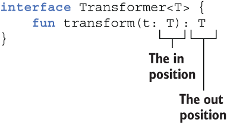
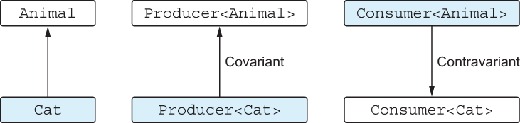
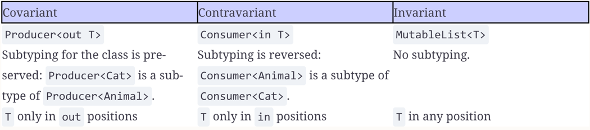

Kotlin in action second edition

* You can see that the name of the class generated by the Kotlin compiler corresponds to the name of the file containing
  the function—capitalized to match Java’s naming scheme and suffixed with Kt.
* @file:JvmName("...") changes default name

```kotlin
package strings
 
fun joinToString( /* ... */ ): String { /* ... */ }
```

to

```kotlin
/* Java */
package strings;
 
public class JoinKt {             
    public static String joinToString(/* ... */) { /* ... */ }
}
```

* Inner and nested classes: Nested by default
  

//5.1.4 Accessing variables in scope

* The `fold` function is conceptually very similar to `reduce`, but instead of putting the first element of your
  collection
  into the accumulator at the beginning, you can choose an arbitrary start value.


* Kotlin’s Array class looks like a regular generic class but is compiled to a Java array.
* Arrays of primitive types are represented by special classes, such as IntArray.

* Anonymous functions provide an alternative syntax to lambda expressions with different rules for resolving the return
  expressions. You can use them if you need to write a block of code with multiple exit points.

```kotlin
    //These are the same at bytecode level
    people.forEach(fun(person) {
        if (person.name == "Alice") return
        println("${person.name} is not Alice")
    })

    people.forEach { person ->
        if (person.name == "Alice") return@forEach
        println("${person.name} is not Alice")
    }
```

* You can mark type as non-nullable on the call site

```kotlin
class KBox<T> {

    fun put(t: T & Any) {
        t == null // Condition 't == null' is always 'false'
    }

    fun putIfNotNull(t: T) {
        t == null
    }
}
```

* If you’re an Android developer, you may find another example to be more familiar: showing activities. Instead of
  passing the class of the activity as a java.lang.Class, you can also use a reified type parameter:

```kotlin
inline fun <reified T : Activity> Context.startActivity() {
  val intent = Intent(this, T::class.java)
  startActivity(intent)
}

startActivity<DetailActivity>()
```

```kotlin
class Producer<T>() // invariant

class Herd<out T : Animal> {
    val size: Int get() = /* ... */
    operator fun get(i: Int): T { /* ... */ }
} // covariant, uses T in out position

interface Comparator<in T>  {
    fun compare(e1: T, e2: T): Int { /* ... */ }
}// contravariant, Uses T in in positions, Comparator<Any> is a subtype of Comparator<String>,
where Any is a supertype of String.
The subtyping relation between comparators for two different types goes
in the opposite direction of the subtyping relation between those types.
```



#12 
